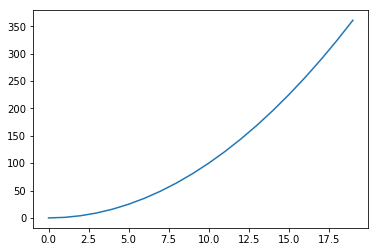

# Hello World
[jupyter notebook快速入门](http://www.codingpy.com/article/getting-started-with-jupyter-notebook-part-1/?utm_source=tuicool&utm_medium=referral)

## 转换成PDF（中文）
1. jupyter nbconvert --to latex HelloWorld.ipynb
2. 修改artcle -> ctexart
3. 使用xelatex编译

## Markdown 单元格

1. 支持HTML代码  
  

2. 支持Latex语法  
$$\int_0^{+\infty} x^2 dx$$

## Python命令


```python
print('hello world!')
```

    hello world!
    


```python
%matplotlib inline
```


```python
import matplotlib.pyplot as plt
import numpy as np

x = np.arange(20)
y = x**2

plt.plot(x, y)
```


    [<matplotlib.lines.Line2D at 0x20549870240>]




